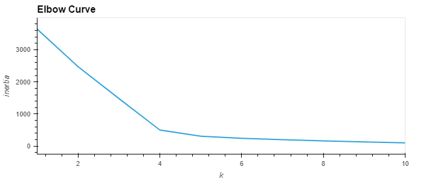
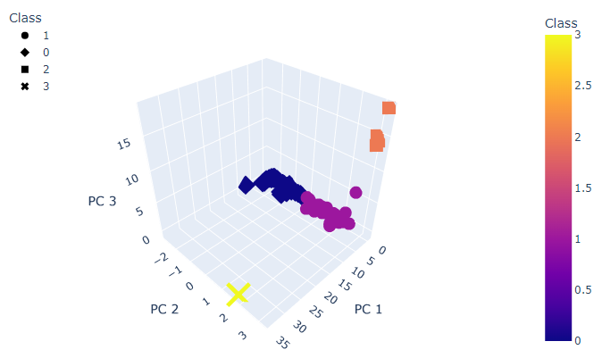
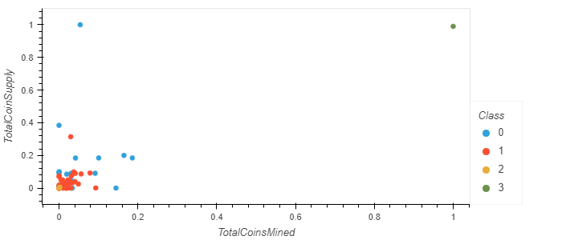

# Cryptocurrencies

## Overview 
Creating an analysis report regarding cryptocurrencies trading market for Accountability Accounting, a prominent investment bank to offer a cryptocurrency investment portfolio for its customers.

This project is using unsurpervised learning tools, preprocessing cryptocurrency data, reducing data dimensions using PCA, clustering cryptocurrency using K-means and visualizing cryptocurrencies results.

## Result

#### Clustering Crytocurrencies Using K-Means - Elbow Curve

#### 3D-Scatter with Clusters

#### 2D-Scatter plot with TotalCoinsMined vs TotalCoinSupply

